# SpacePoint Portal

The **SpacePoint Portal** is a role-based digital platform designed to support the SpacePoint ecosystem by managing learning journeys, training workflows, collaboration activities, and engagement programs.

The system enables structured participation from multiple user roles including **Admins, Instructors, Ambassadors, and Interns**, each with dedicated workflows and permissions.

This repository contains the **backend implementation of the SpacePoint Portal**, built using **FastAPI**, **PostgreSQL**, and **Docker**, following a scalable layered architecture.

The backend exposes REST APIs responsible for managing:

- Authentication and authorization
- Role-based access control (RBAC)
- Instructor onboarding workflows
- Ambassador outreach and CRM activities
- Intern task submission workflows
- Administrative approvals
- Opportunity management
- Points and recognition systems
- Certificates and badges
- Platform analytics and moderation

---

# Platform Workflow Overview

The SpacePoint Portal manages multiple learning and collaboration workflows.

Users progress through structured activities depending on their assigned roles.

Main workflows include:

1. Instructor onboarding and qualification
2. Ambassador outreach and CRM activities
3. Intern project submission and evaluation
4. Administrative approvals and moderation
5. Opportunity management
6. Points and recognition system

The diagram below illustrates the overall workflow of the platform.

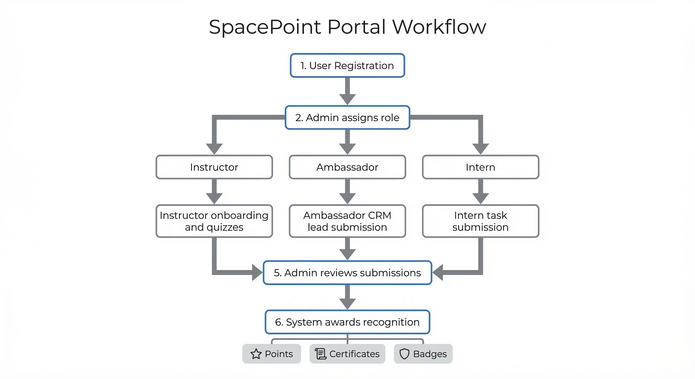

---

# Platform Roles

The portal supports multiple roles representing different participants in the SpacePoint ecosystem.

## Admin

Admins manage the entire platform and supervise all workflows.

Admin capabilities include:

- User management
- Role assignment
- Submission approvals
- Platform analytics
- Opportunity management
- Recognition system management

---

## Instructor

Instructors participate in educational workflows and must complete qualification stages before contributing.

Instructor workflow includes:

- Submitting onboarding information
- Completing qualification quizzes
- Submitting scenario responses
- Logging onsite activities

### Instructor Onboarding

Instructors begin by submitting onboarding information which verifies their eligibility to continue the learning journey.

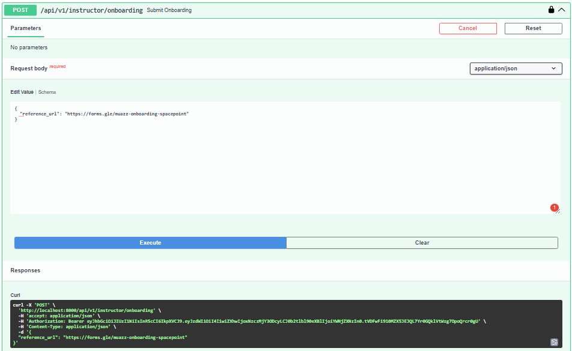

---

### Instructor Quiz Submission

After onboarding approval, instructors must complete qualification quizzes.

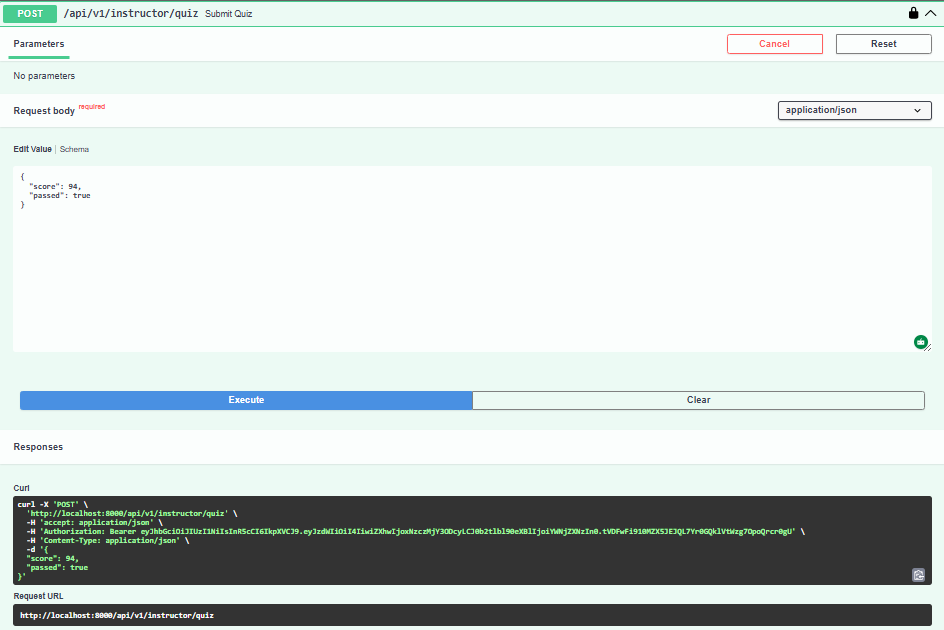

---

### Scenario Submission

Instructors complete scenario tasks used to evaluate practical knowledge.

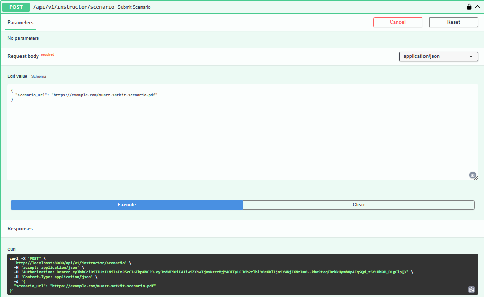

---

### Onsite Activity Logging

Instructors can log training activities performed during onsite sessions.

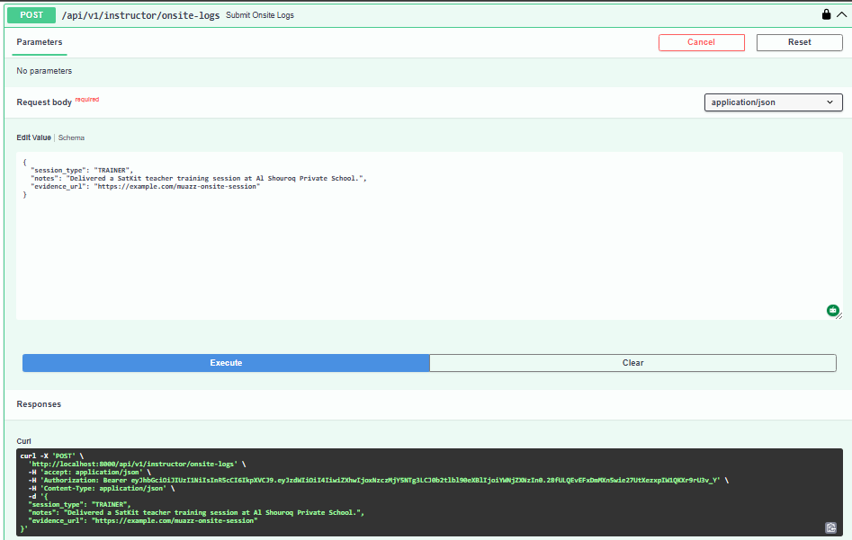

---

# Ambassador Workflow

Ambassadors support outreach and ecosystem growth.

Ambassador responsibilities include:

- Managing CRM leads
- Submitting proposals
- Supporting partnerships
- Participating in outreach activities

### CRM Lead Submission

Ambassadors submit potential collaboration leads through the CRM system.

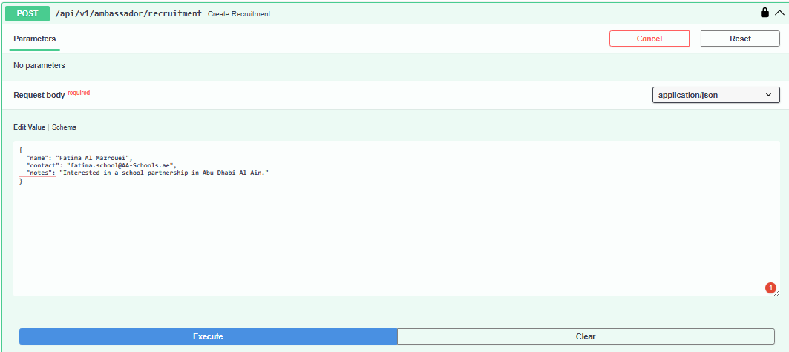

---

### Proposal Submission

Ambassadors submit proposals for review by administrators.

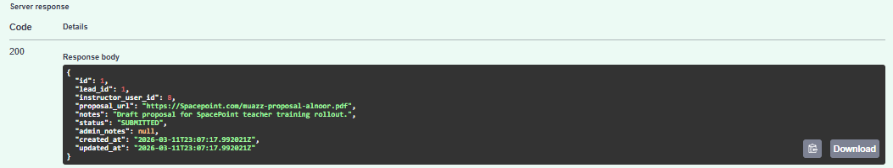

---

# Intern Workflow

Interns participate in development tasks and training programs.

Intern activities include:

- Completing assigned tasks
- Submitting deliverables
- Tracking learning progress
- Participating in platform development

### Intern Submission

Interns upload project submissions for evaluation.

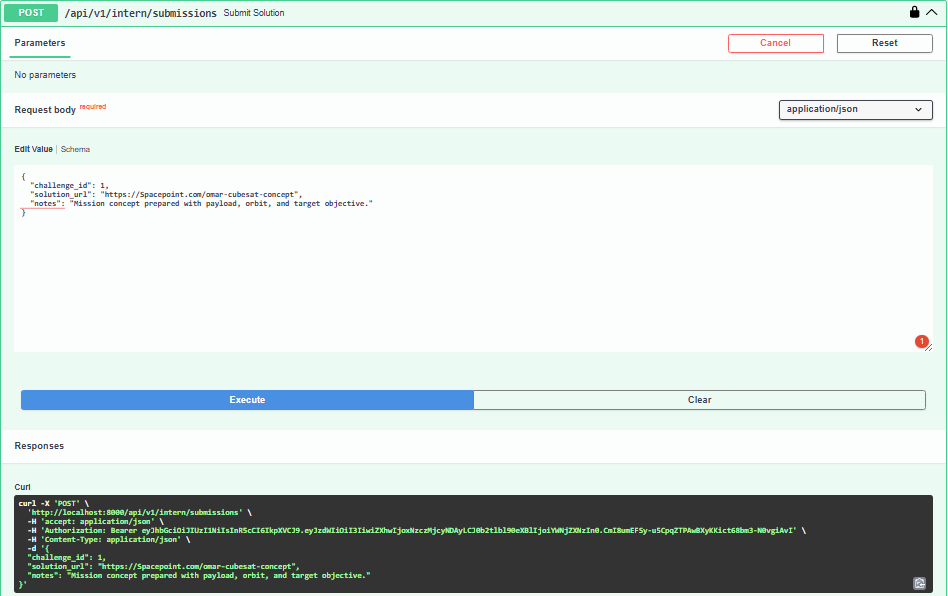

---

# Admin Management

Admins supervise and manage all platform activities.

### User Management

Admins can view and manage all platform users.

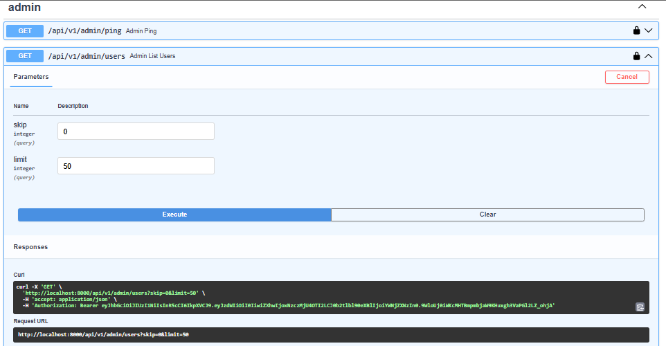

---

### Role Assignment

Admins assign roles such as instructor, ambassador, or intern.

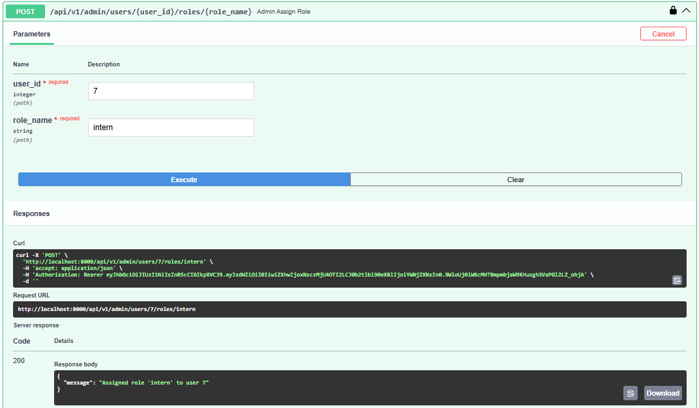

---

### Platform Overview

Admins have access to platform analytics through the overview dashboard.

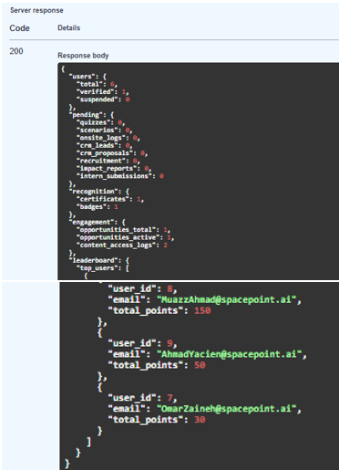

---

# Recognition System

The portal includes a recognition system to reward active participation.

### Points System

Users earn points based on participation and platform contributions.

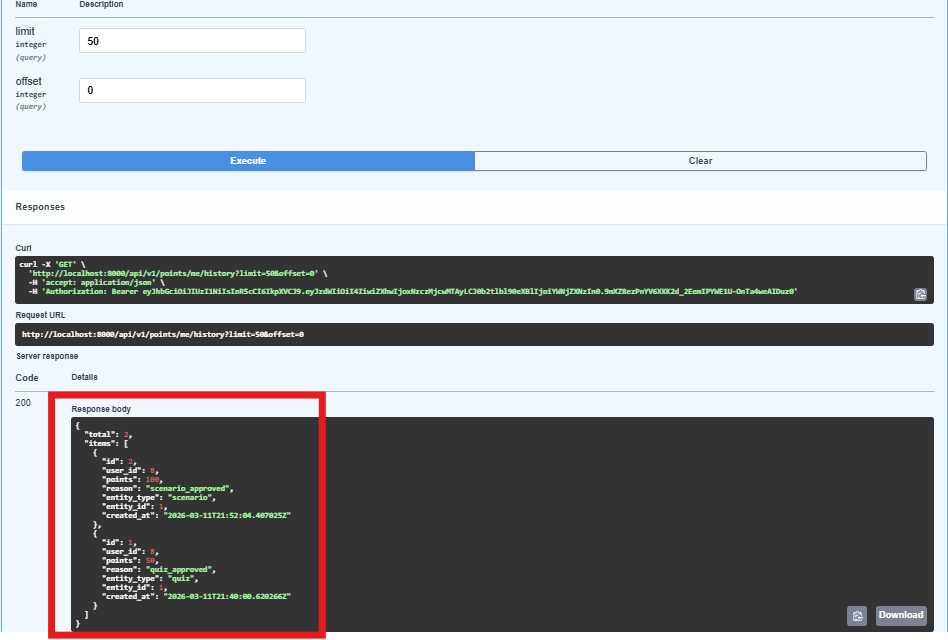

---

### Certificates

Certificates are issued when users complete major milestones.

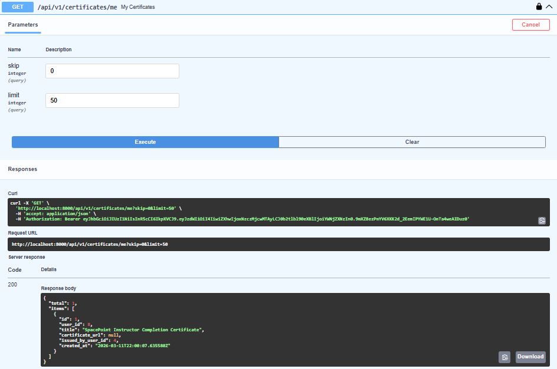

---

### Badges

Badges reward achievements and contributions.

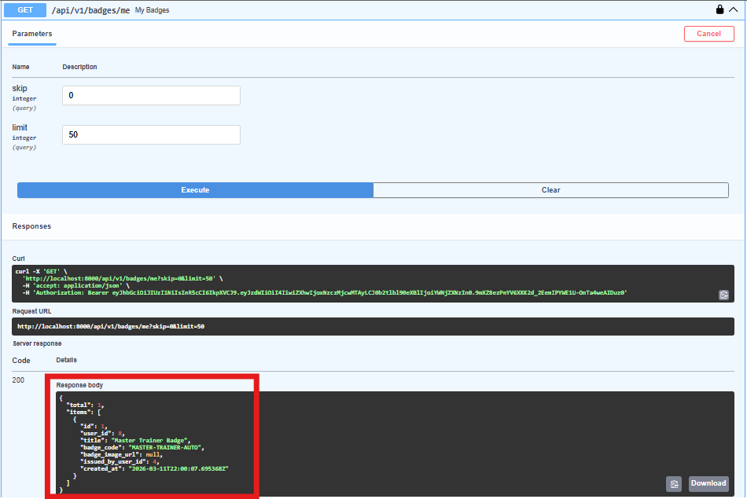

---

# Opportunities Management

Admins can publish opportunities available to the ecosystem.

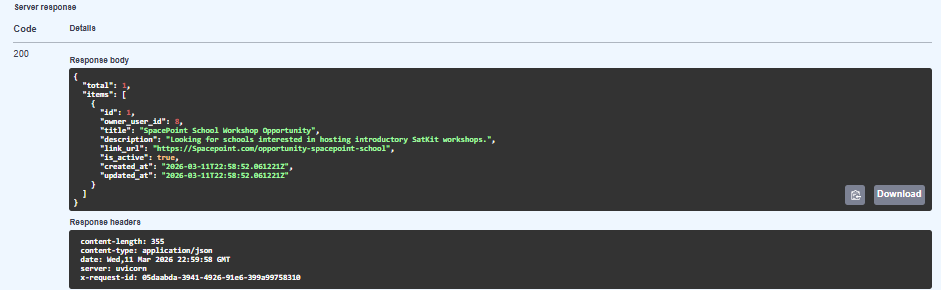

---

# Portal Interface Screenshots

Below are examples of the SpacePoint Portal interface demonstrating various workflows and features across different user roles.

### Instructor Interface

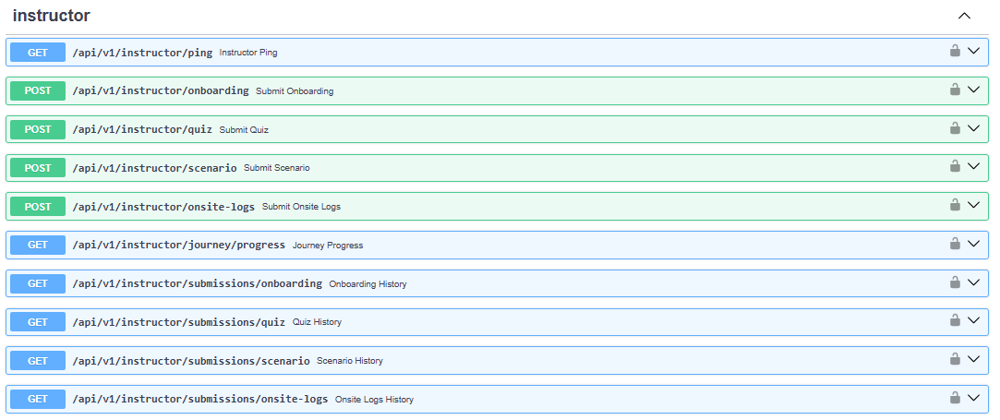

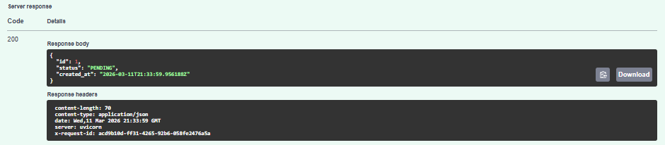

---

### Ambassador Interface

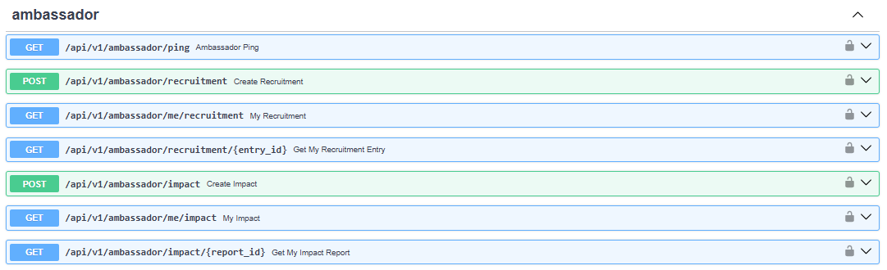

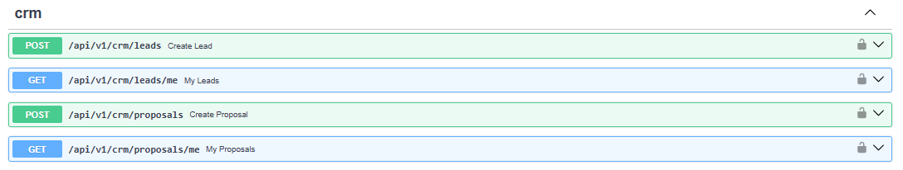

---

### Admin Interface

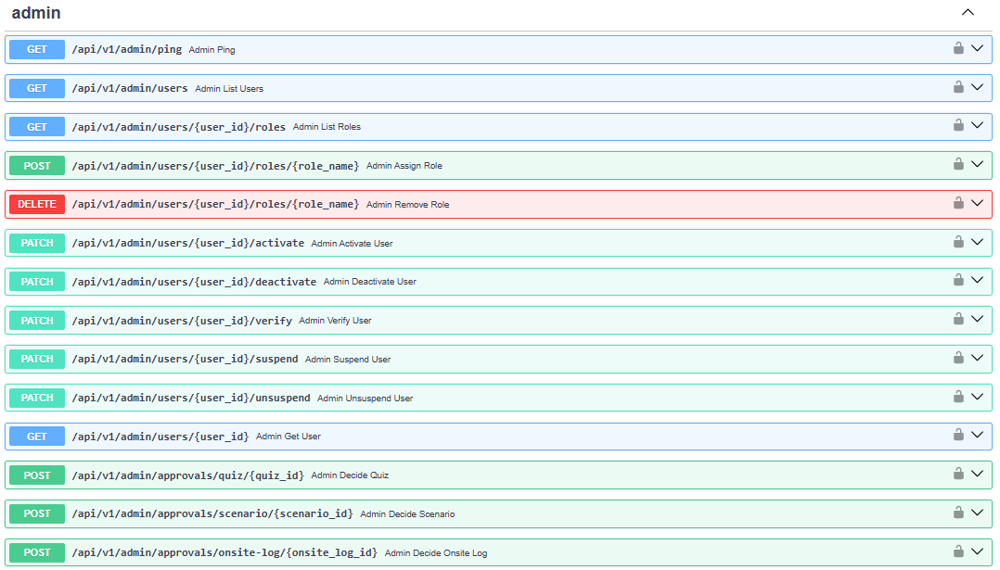

---

### Intern Interface

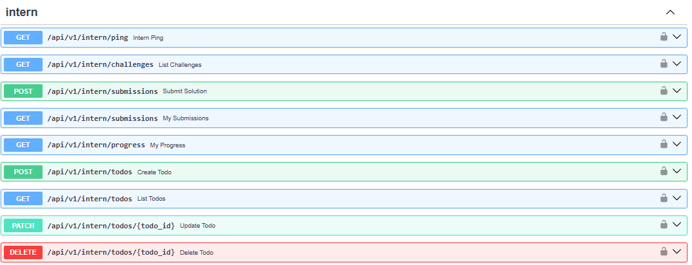

---

# Technology Stack

The backend is implemented using the following technologies:

- FastAPI
- PostgreSQL
- SQLAlchemy
- Alembic (database migrations)
- JWT Authentication
- Docker
- Docker Compose

---

# System Architecture Overview

The SpacePoint Portal backend follows a modular layered architecture designed to ensure scalability, maintainability, and separation of concerns.

The system is composed of several layers:

- **API Layer** → Handles HTTP requests through FastAPI routers
- **Service Layer** → Contains business logic and workflow processing
- **Repository Layer** → Handles database interactions
- **Model Layer** → Defines ORM database models
- **Schema Layer** → Defines request/response data structures using Pydantic

The backend communicates with a **PostgreSQL database** and is deployed using **Docker containers**.

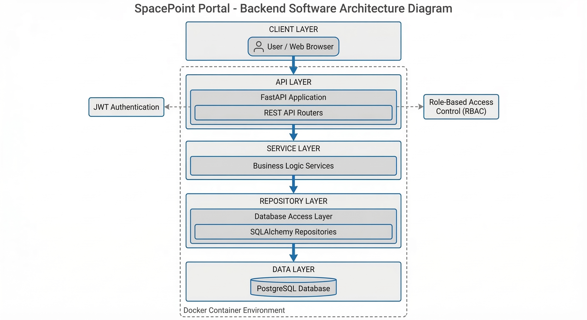

---

# System Architecture

The system follows a layered modular architecture.

app/
├── api/ # HTTP endpoints
├── services/ # Business logic
├── repositories/ # Database access layer
├── models/ # ORM models
├── schemas/ # Pydantic schemas
├── core/ # configuration & security
└── utils/ # helper utilities

This architecture ensures separation of concerns, scalability, and maintainability.

---

# Database Design (ERD)

The platform database is designed using relational modeling with SQLAlchemy ORM and managed through Alembic migrations.

Key entities include:

- Users
- Roles
- User Roles
- Submissions
- Onsite Logs
- CRM Leads
- CRM Proposals
- Opportunities
- Points Ledger
- Certificates
- Badges

The Entity Relationship Diagram below illustrates the core relationships between the main tables.

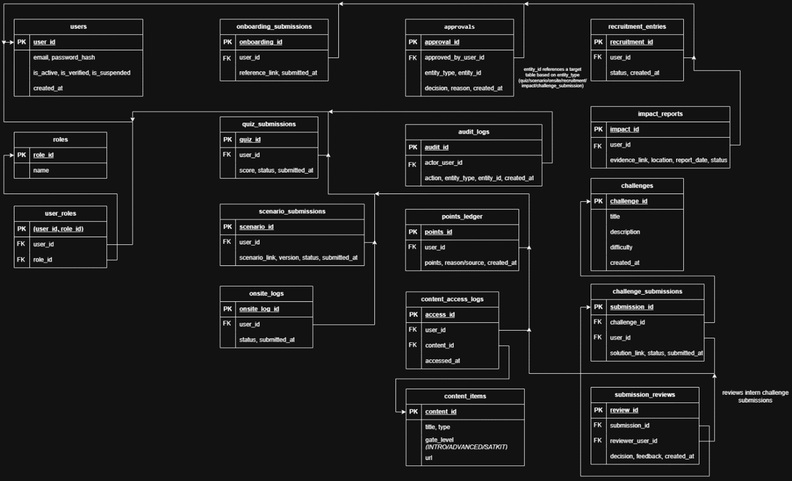

---

# Running the Project

Run the backend using Docker.

From the `backend` folder:
docker compose up --build
---

# API Access

After starting the system:

Health check

http://localhost:8000/health

Database health

http://localhost:8000/api/v1/health/db

Swagger documentation

http://localhost:8000/docs

---

# Authentication

### Register

POST /api/v1/auth/register

### Login

POST /api/v1/auth/login

Returns:

{
"access_token": "...",
"token_type": "bearer"
}

Use the token in Swagger authorization:

Bearer YOUR_TOKEN

---

# Role-Based Access Control

Supported roles:

- admin
- instructor
- ambassador
- intern

Protected routes include:

/api/v1/admin/*
/api/v1/instructor/*
/api/v1/ambassador/*
/api/v1/intern/*

Error behavior:

401 → Not authenticated
403 → Missing required role

---

# Database & Migrations

Alembic is used for database migrations.

Create migration:

alembic revision --autogenerate -m "message"

Apply migration:

alembic upgrade head

---

# Environment Files

Environment configuration templates:

.env.example
.env.dev
.env.prod.example

---

# Author

**Mohammad Fares Aljamous**

Computer Engineering — Artificial Intelligence Concentration  
Abu Dhabi University

Internship Project — SpacePoint Portal Backend